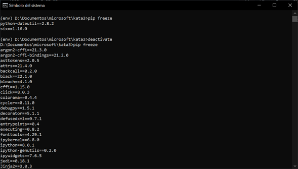

### Crear y Activar un entorno virtual

Para crear el entorno virtual vamos a utilizar el comando:

* `python -m venv env`

Para activarlo usaremos el que se muestra a continuación:

* `env\Scripts\activate`

##### Instalamos un paquete dentro del entorno creado

Para eso vamos ocupar el siguiente comando:

* `pip install python-dateutil`

Verificamos que se haya instalado la biblioteca de dateutil

##### Verificar paquetes instalados

Vamos a utilizar el siguiente comando:

* `Pip freeze`

Ahora desactivamos el entorno y volvemos a ejecutar el comando anterior

##### Probando el paquete instalado

